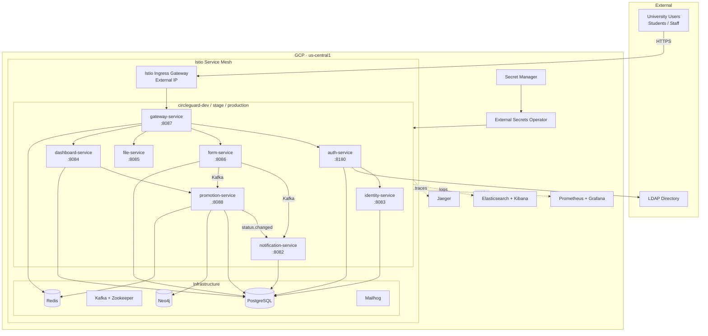
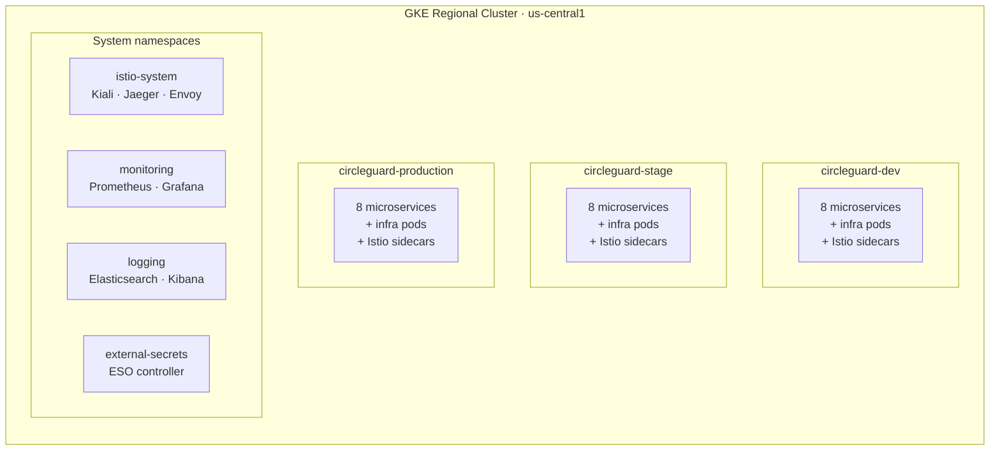
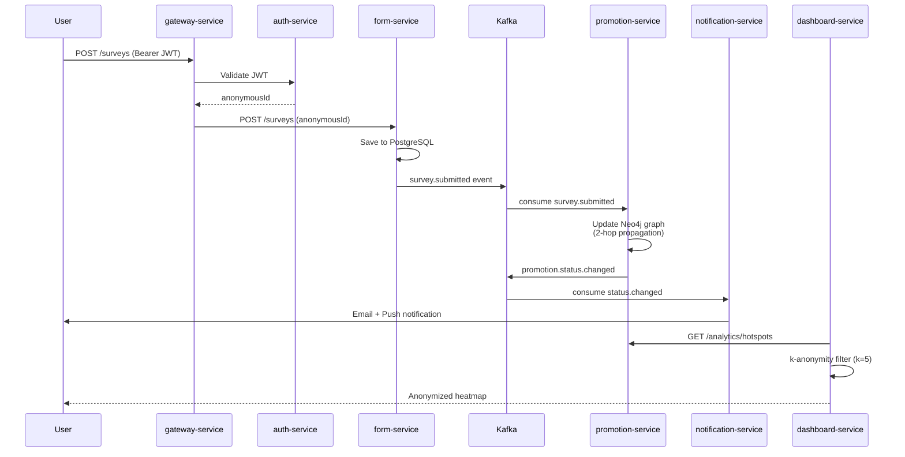
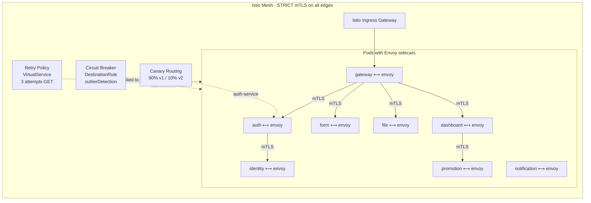

# CircleGuard — System Architecture

## 1. System Overview

```mermaid
graph TB
    subgraph External
        U[University Users<br/>Students / Staff]
        LDAP[LDAP Directory]
    end

    subgraph GCP["GCP · us-central1"]
        subgraph Istio["Istio Service Mesh"]
            GW[Istio Ingress Gateway<br/>External IP]

            subgraph Services["circleguard-dev / stage / production"]
                AUTH[auth-service<br/>:8180]
                DASH[dashboard-service<br/>:8084]
                FILE[file-service<br/>:8085]
                FORM[form-service<br/>:8086]
                GATE[gateway-service<br/>:8087]
                IDENT[identity-service<br/>:8083]
                NOTIF[notification-service<br/>:8082]
                PROMO[promotion-service<br/>:8088]
            end

            subgraph Infra["Infrastructure"]
                PG[(PostgreSQL)]
                KAFKA[Kafka + Zookeeper]
                REDIS[(Redis)]
                NEO4J[(Neo4j)]
                MAIL[Mailhog]
            end
        end

        SM[Secret Manager]
        ESO[External Secrets Operator]
        PROM[Prometheus + Grafana]
        ES[Elasticsearch + Kibana]
        JAEGER[Jaeger]
    end

    U -->|HTTPS| GW
    GW --> GATE
    GATE --> AUTH
    AUTH --> IDENT
    GATE --> FORM
    GATE --> FILE
    GATE --> DASH
    DASH --> PROMO
    FORM -->|Kafka| NOTIF
    FORM -->|Kafka| PROMO
    PROMO -->|status.changed| NOTIF

    AUTH --> LDAP
    AUTH --> PG
    DASH --> PG
    FORM --> PG
    IDENT --> PG
    NOTIF --> PG
    PROMO --> PG
    PROMO --> NEO4J
    PROMO --> REDIS
    GATE --> REDIS

    SM --> ESO --> Services
    Services -.->|metrics| PROM
    Services -.->|logs| ES
    Services -.->|traces| JAEGER
```

---

## 2. Deployment View (GKE Namespaces)

```mermaid
graph LR
    subgraph GKE["GKE Regional Cluster · us-central1"]
        subgraph Dev["circleguard-dev"]
            D1[8 microservices<br/>+ infra pods<br/>+ Istio sidecars]
        end
        subgraph Stage["circleguard-stage"]
            S1[8 microservices<br/>+ infra pods<br/>+ Istio sidecars]
        end
        subgraph Prod["circleguard-production"]
            P1[8 microservices<br/>+ infra pods<br/>+ Istio sidecars]
        end
        subgraph System["System namespaces"]
            IS[istio-system<br/>Kiali · Jaeger · Envoy]
            MON[monitoring<br/>Prometheus · Grafana]
            LOG[logging<br/>Elasticsearch · Kibana]
            ESO2[external-secrets<br/>ESO controller]
        end
    end
```

---

## 3. Data Flow — Health Survey Submission

```mermaid
sequenceDiagram
    participant U as User
    participant GW as gateway-service
    participant AUTH as auth-service
    participant FORM as form-service
    participant KAFKA as Kafka
    participant PROMO as promotion-service
    participant NOTIF as notification-service
    participant DASH as dashboard-service

    U->>GW: POST /surveys (Bearer JWT)
    GW->>AUTH: Validate JWT
    AUTH-->>GW: anonymousId
    GW->>FORM: POST /surveys (anonymousId)
    FORM->>FORM: Save to PostgreSQL
    FORM->>KAFKA: survey.submitted event
    KAFKA->>PROMO: consume survey.submitted
    PROMO->>PROMO: Update Neo4j graph<br/>(2-hop propagation)
    PROMO->>KAFKA: promotion.status.changed
    KAFKA->>NOTIF: consume status.changed
    NOTIF->>U: Email + Push notification
    DASH->>PROMO: GET /analytics/hotspots
    DASH->>DASH: k-anonymity filter (k=5)
    DASH-->>U: Anonymized heatmap
```

---

## 4. Istio Service Mesh View

```mermaid
graph TB
    subgraph Mesh["Istio Mesh · STRICT mTLS on all edges"]
        direction TB
        IGW[Istio Ingress Gateway]
        
        subgraph Envoys["Pods with Envoy sidecars"]
            A[auth ⟷ envoy]
            DA[dashboard ⟷ envoy]
            FI[file ⟷ envoy]
            FO[form ⟷ envoy]
            G[gateway ⟷ envoy]
            I[identity ⟷ envoy]
            N[notification ⟷ envoy]
            P[promotion ⟷ envoy]
        end

        CB[Circuit Breaker<br/>DestinationRule<br/>outlierDetection]
        RT[Retry Policy<br/>VirtualService<br/>3 attempts GET]
        CAN[Canary Routing<br/>90% v1 / 10% v2]
    end

    IGW --> G
    G -->|mTLS| A
    A -->|mTLS| I
    G -->|mTLS| FO
    G -->|mTLS| FI
    G -->|mTLS| DA
    DA -->|mTLS| P

    CB -.->|applied to all| Envoys
    RT -.->|applied to all| Envoys
    CAN -.->|auth-service| A
```
