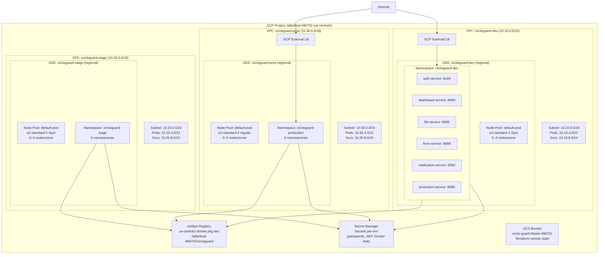

# Infrastructure Diagram

CircleGuard GCP infrastructure across dev, stage, and prod environments.

## System overview



## Terraform state layout

```
gs://circle-guard-tfstate-496702/
  envs/
    dev/    ← VPC + GKE dev + AR + Secrets dev + IAM dev
    stage/  ← VPC + GKE stage + Secrets stage + IAM stage
    prod/   ← VPC + GKE prod + Secrets prod + IAM prod
```

## IAM service accounts per environment

Each env creates the following Google Service Accounts, bound to Kubernetes SAs via Workload Identity:

| GCP SA | Purpose |
|--------|---------|
| `cg-auth-<env>` | auth-service pod identity |
| `cg-dashboard-<env>` | dashboard-service pod identity |
| `cg-file-<env>` | file-service pod identity |
| `cg-form-<env>` | form-service pod identity |
| `cg-notification-<env>` | notification-service pod identity |
| `cg-promotion-<env>` | promotion-service pod identity |
| `cg-eso-<env>` | External Secrets Operator (Secret Manager access) |
| `cg-jenkins-<env>` | Jenkins deploy SA |
| `cg-gke-<env-short>` | GKE node pool SA (logging, monitoring, AR pull) |
