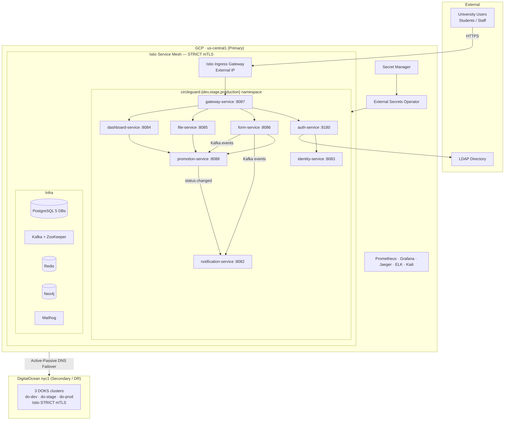
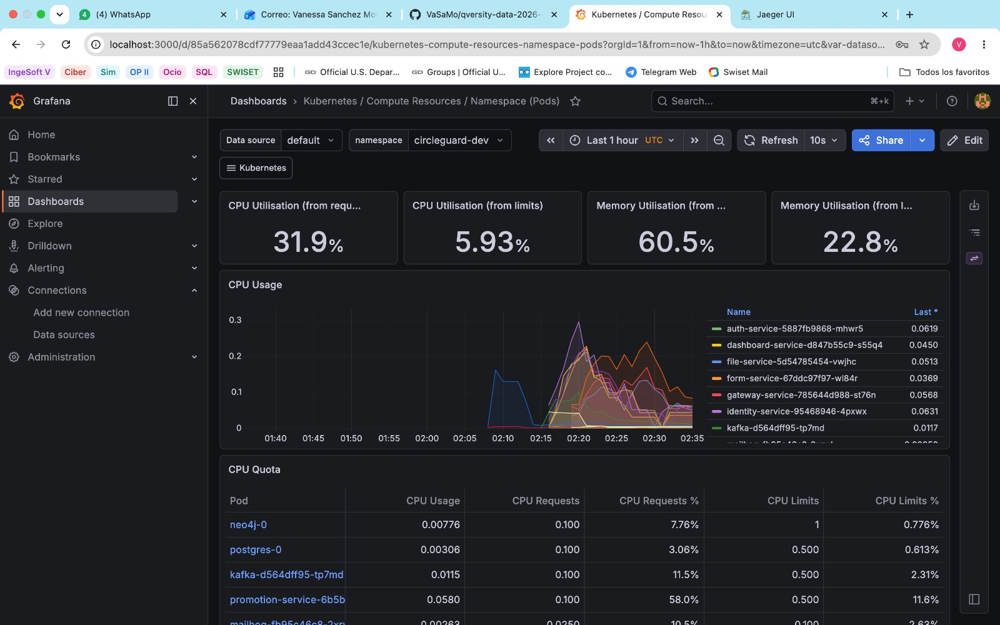
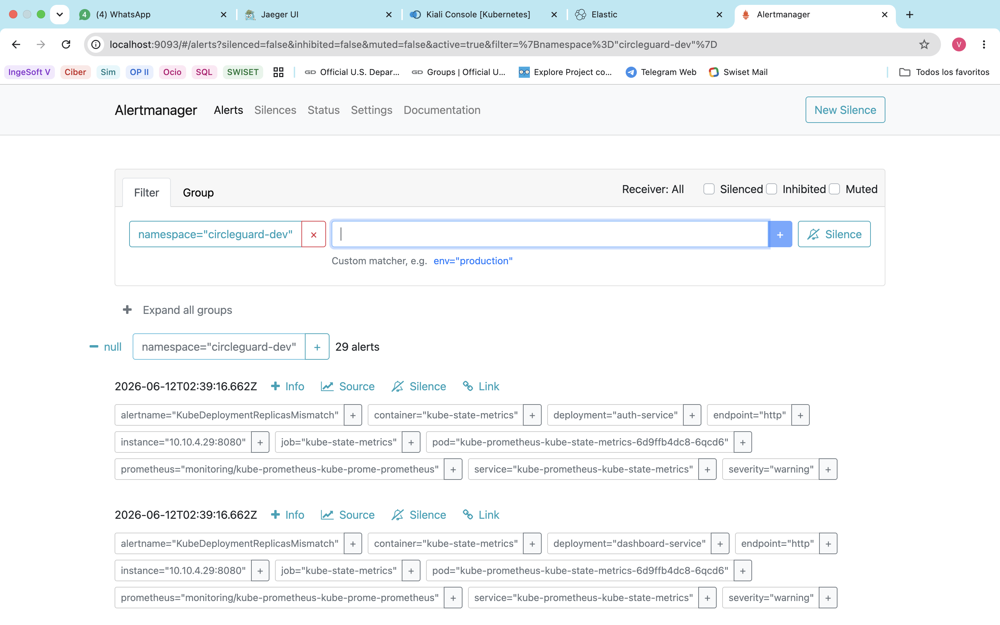
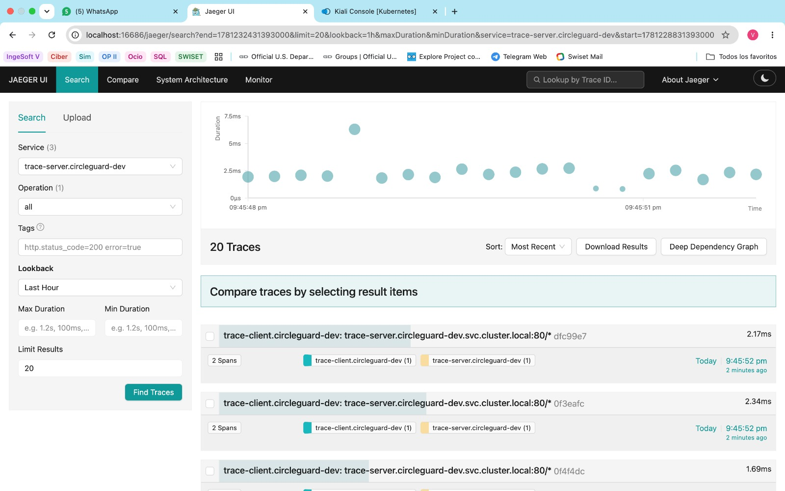
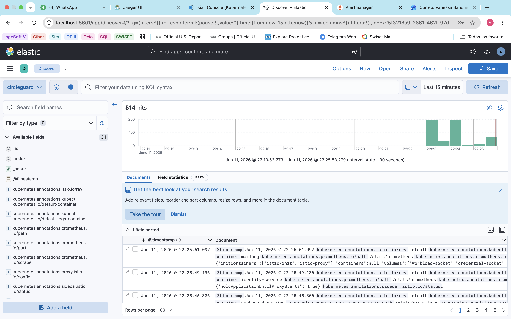
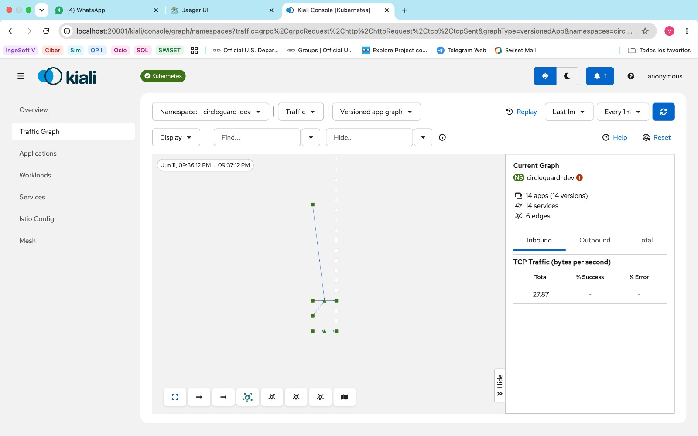
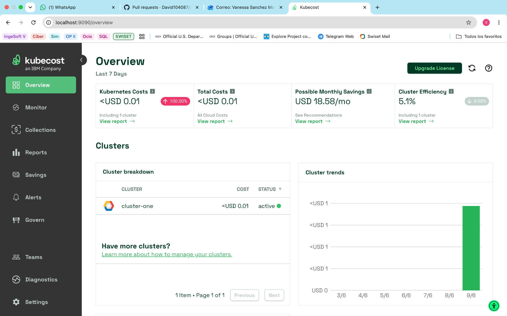

# CircleGuard — Final Project Report
## SE5 Software Engineering 5 · Universidad · 2026

# VIDEO: https://youtu.be/Cw0wbN6N6cw

---

# Table of Contents

1. [Project Overview](#1-project-overview)
2. [Infrastructure as Code with Terraform (20%)](#2-infrastructure-as-code-with-terraform-20)
3. [Design Patterns (10%)](#3-design-patterns-10)
4. [Advanced CI/CD (15%)](#4-advanced-cicd-15)
5. [Complete Testing (15%)](#5-complete-testing-15)
6. [Change Management and Release Notes (5%)](#6-change-management-and-release-notes-5)
7. [Observability and Monitoring (10%)](#7-observability-and-monitoring-10)
8. [Security (5%)](#8-security-5)
9. [Documentation and Presentation (10%)](#9-documentation-and-presentation-10)
10. [Bonus: Service Mesh — Istio (5%)](#10-bonus-service-mesh--istio-5)
11. [Bonus: Multi-Cloud (5%)](#11-bonus-multi-cloud-5)
12. [Bonus: Chaos Engineering (5%)](#12-bonus-chaos-engineering-5)
13. [Bonus: FinOps (5%)](#13-bonus-finops-5)
14. [Deliverables Summary](#14-deliverables-summary)

---

# 1. Project Overview

## 1.1 Application Description

**CircleGuard** is a university health-monitoring platform that enables educational institutions to track and manage the health status of students and staff. The system collects health survey data, performs geospatial contact-tracing analytics, manages digital health certificates, and sends automated notifications when exposure risks are detected.

The architecture follows a cloud-native microservices model: eight independent Spring Boot 3.2.x / Java 21 services communicate via Kafka (asynchronous) and REST (synchronous), each owning its own data store.

## 1.2 The Eight Microservices

| Service | Port | Responsibility |
|---------|------|---------------|
| `auth-service` | 8180 | JWT authentication, dual-chain LDAP + local |
| `dashboard-service` | 8084 | Geospatial hotspot analytics, k-anonymity filter |
| `file-service` | 8085 | Secure certificate and document storage |
| `form-service` | 8086 | Health survey submission, Kafka producer |
| `gateway-service` | 8087 | API gateway, QR code validation, Redis sessions |
| `identity-service` | 8083 | Identity vault, AES-encrypted real identities |
| `notification-service` | 8082 | Email/push notifications, Kafka consumer |
| `promotion-service` | 8088 | Health status lifecycle, Neo4j graph propagation |

## 1.3 Technology Stack

| Layer | Technology |
|-------|-----------|
| Language / Runtime | Java 21, Spring Boot 3.2.x |
| Build | Gradle Kotlin DSL |
| Containerization | Docker (images on Docker Hub) |
| Orchestration | Kubernetes (GKE + DOKS) |
| Service Mesh | Istio 1.29.2 |
| Infrastructure as Code | Terraform >= 1.6 |
| CI/CD | Jenkins (Docker-in-Docker) |
| Code Quality | SonarQube, JaCoCo |
| Security Scanning | Trivy, OWASP ZAP |
| Observability | Prometheus, Grafana, Jaeger, ELK, Kiali |
| Cost Monitoring | Kubecost, GCP Billing Export to BigQuery |
| Secrets Management | GCP Secret Manager + External Secrets Operator |
| Chaos Engineering | Chaos Mesh v2.7.0 |

## 1.4 System Architecture



---

# 2. Infrastructure as Code with Terraform (20%)

## 2.1 Remote State Backend

All Terraform state is stored remotely in a Google Cloud Storage (GCS) bucket with versioning enabled, preventing state corruption and enabling team collaboration:

```
Bucket: gs://circle-guard-tfstate-496702/
├── envs/dev/default.tfstate
├── envs/stage/default.tfstate
├── envs/prod/default.tfstate
├── envs/do-dev/default.tfstate
├── envs/do-stage/default.tfstate
└── envs/do-prod/default.tfstate
```

Each environment's backend is declared in its `backend.tf` with a unique prefix, ensuring complete state isolation.

## 2.2 Modular Structure

The Terraform code is organized into reusable modules that are composed per environment:

```
terraform/
├── modules/
│   ├── vpc/              # VPC, subnets, firewall rules
│   ├── gke/              # GKE cluster + node pool (Spot support)
│   ├── artifact_registry/# Docker registry in us-central1
│   ├── secrets/          # GCP Secret Manager secrets
│   ├── iam/              # Service accounts + Workload Identity
│   └── doks/             # DigitalOcean Kubernetes (multi-cloud)
├── envs/
│   ├── dev/              # GCP dev (1 node, Spot, zonal us-central1-a)
│   ├── stage/            # GCP stage (2 nodes, Spot)
│   ├── prod/             # GCP prod (2 nodes, regular, autoscale 0–5)
│   ├── do-dev/           # DOKS dev (s-4vcpu-8gb, nyc1)
│   ├── do-stage/         # DOKS stage (s-2vcpu-4gb, nyc1)
│   └── do-prod/          # DOKS prod (s-2vcpu-4gb, nyc1)
└── README.md
```

**Key module design decisions:**

- The `gke` module exposes a `use_spot` variable: dev and stage use Spot instances (64% cheaper), prod uses regular instances for reliability.
- `min_node_count = 0` is configured in all node pools, enabling scale-to-zero between sessions.
- `deletion_protection = false` is explicitly set to allow clean `terraform destroy` during overnight shutdowns.
- The `doks` module mirrors the GKE module's interface, using `min_nodes=0` for scale-to-zero and `max_nodes=1` to respect account droplet limits.

## 2.3 Multi-Environment Configuration

### Dev Environment — `terraform/envs/dev/`

```hcl
module "gke" {
  source       = "../../modules/gke"
  project_id   = var.project_id
  region       = "us-central1-a"      # Zonal (avoids stockout in multi-zone)
  cluster_name = "circleguard-dev"
  node_count   = 1
  machine_type = "e2-standard-2"
  use_spot     = true                 # Spot VMs: $0.024/h vs $0.067/h
  min_node_count = 0                  # Scale-to-zero enabled
  max_node_count = 3
  deletion_protection = false
}
```

### Production Environment — `terraform/envs/prod/`

```hcl
module "gke" {
  source       = "../../modules/gke"
  cluster_name = "circleguard-prod"
  node_count   = 2
  machine_type = "e2-standard-2"
  use_spot     = false                # Regular VMs for production reliability
  min_node_count = 0
  max_node_count = 5
}
```

## 2.4 Infrastructure Architecture Diagram

```mermaid
graph TB
    subgraph GCP["GCP Project: tallerfinal-496702 (us-central1)"]
        AR["Artifact Registry\ncircleguard Docker images"]
        SM["Secret Manager\nDB passwords, JWT, Docker Hub"]
        GCS["GCS Bucket\ncircle-guard-tfstate-496702\nTerraform remote state"]

        subgraph DEV["VPC: circleguard-dev (10.10.0.0/16)"]
            GKE_DEV["GKE: circleguard-dev\nzonal us-central1-a\ne2-standard-2 Spot · 0–3 nodes"]
            NS_DEV["Namespace: circleguard-dev\n8 microservices + Istio mesh"]
            LB_DEV["GCP External LB · port 80/443"]
        end

        subgraph STAGE["VPC: circleguard-stage (10.20.0.0/16)"]
            GKE_STG["GKE: circleguard-stage\ne2-standard-2 Spot · 0–3 nodes"]
            NS_STG["Namespace: circleguard-stage\n8 microservices + Istio mesh"]
        end

        subgraph PROD["VPC: circleguard-prod (10.30.0.0/16)"]
            GKE_PRD["GKE: circleguard-prod\ne2-standard-2 regular · 0–5 nodes"]
            NS_PRD["Namespace: circleguard-production\n8 microservices + Istio mesh"]
            LB_PRD["GCP External LB · HTTPS"]
        end
    end

    subgraph DO["DigitalOcean (nyc1) — Multi-Cloud Secondary"]
        DOKS_DEV["DOKS: circleguard-do-dev\ns-4vcpu-8gb · max 1 node"]
        DOKS_STG["DOKS: circleguard-do-stage\ns-2vcpu-4gb · max 1 node"]
        DOKS_PRD["DOKS: circleguard-do-prod\ns-2vcpu-4gb · max 1 node"]
    end

    Internet --> LB_DEV
    Internet --> LB_PRD
    Internet -->|DNS Failover| DOKS_PRD
```



## 2.5 Terraform Validation

All environments pass `terraform fmt` and `terraform validate` cleanly. After applying, `terraform plan` produces no diff, confirming idempotency. The three GCP clusters were applied sequentially (per quota constraints: 12 vCPUs total) and verified with `kubectl get nodes`.

---

# 3. Design Patterns (10%)

## 3.1 Existing Patterns Identified

A systematic review of all eight microservices' source code identified **12 design patterns**:

| # | Pattern | Services | Description |
|---|---------|---------|-------------|
| 1 | **API Gateway** | `gateway-service` | Single entry point via Istio Ingress Gateway; hides internal topology |
| 2 | **Database per Service** | All 8 | Each service owns its schema; `promotion-service` uses Neo4j + PostgreSQL (polyglot) |
| 3 | **Event-Driven (Kafka)** | `form-service` → consumers | Asynchronous domain events decouple producers from consumers |
| 4 | **JWT / Token Auth** | `auth-service`, `gateway-service` | Stateless HS256-signed JWTs; `JwtAuthenticationFilter extends OncePerRequestFilter` |
| 5 | **k-Anonymity Privacy Filter** | `dashboard-service` | Suppresses hotspot data for groups < k=5 users; prevents re-identification |
| 6 | **Repository Pattern** | All 8 | Spring Data `JpaRepository` / `Neo4jRepository` encapsulate all data access |
| 7 | **REST Client Pattern** | `auth→identity`, `dashboard→promotion` | `RestTemplate`/`WebClient` for synchronous inter-service calls |
| 8 | **Dual Authentication Chain** | `auth-service` | LDAP provider → DAO provider fallback chain in Spring Security |
| 9 | **Strategy (Notification)** | `notification-service` | Email, SMS, and push dispatched in parallel via `CompletableFuture.allOf` |
| 10 | **Two-Hop Graph Propagation** | `promotion-service` | Cypher query propagates status changes through Neo4j ENCOUNTERED + MEMBER_OF relationships |
| 11 | **Two-Level Cache (Caffeine + Redis)** | `promotion-service` | L1 local cache (Caffeine, 5-min TTL) + L2 distributed (Redis); `@Cacheable` / `@CacheEvict` |
| 12 | **Encryption at Rest (JPA Converter)** | `identity-service` | AES via `@Converter` transparently encrypts `real_identity` on INSERT/SELECT |

## 3.2 New Pattern 1: Circuit Breaker + Retry (Resilience Pattern)

Implemented via **Istio DestinationRule** and **VirtualService** — zero application code changes required.

**Circuit Breaker** (`k8s/istio/destination-rules.yaml`) — applied to all 8 services:

```yaml
trafficPolicy:
  connectionPool:
    tcp:
      maxConnections: 100
    http:
      http1MaxPendingRequests: 50
      http2MaxRequests: 100
  outlierDetection:
    consecutive5xxErrors: 5      # Open circuit after 5 consecutive 5xx errors
    interval: 30s                # Evaluation window
    baseEjectionTime: 30s        # Minimum ejection time (exponential backoff)
    maxEjectionPercent: 50       # Never eject more than 50% of hosts
```

**Retry Policy** (`k8s/istio/virtual-services.yaml`) — applied to idempotent GET endpoints:

```yaml
match:
  - method:
      exact: GET
retries:
  attempts: 3
  perTryTimeout: 5s
  retryOn: 5xx,gateway-error,connect-failure,retriable-4xx
```

POST/PUT/DELETE endpoints deliberately do **not** have retries (non-idempotent operations).

**Benefits:**
- *Fail fast* — open circuit returns 503 in <100ms vs waiting a 30s timeout
- *Fault isolation* — a failing service does not cascade to upstream callers
- *Zero-code* — no Resilience4j/Hystrix library needed in Spring Boot services

## 3.3 New Pattern 2: External Configuration (Configuration Pattern)

Implemented via **GCP Secret Manager** + **External Secrets Operator (ESO)**.

All secrets that were previously hardcoded in `application.yml` are now stored in GCP Secret Manager. ESO automatically syncs them into Kubernetes Secrets on a 1-hour refresh interval. Services mount these secrets as environment variables — no code change required.

**ExternalSecret resource example:**

```yaml
apiVersion: external-secrets.io/v1beta1
kind: ExternalSecret
metadata:
  name: auth-service-secrets
  namespace: circleguard-dev
spec:
  refreshInterval: 1h
  secretStoreRef:
    name: gcp-secretstore
    kind: ClusterSecretStore
  target:
    name: auth-service-secrets
  data:
    - secretKey: DB_PASSWORD
      remoteRef:
        key: circleguard-auth-db-password
    - secretKey: JWT_SECRET
      remoteRef:
        key: circleguard-jwt-secret
```

**Result:** `grep -rE "password:|secret:" k8s/` returns no plaintext values — all are `ExternalSecret` references.

## 3.4 New Pattern 3: Sidecar (Infrastructure Pattern)

Implemented via **Istio's Envoy proxy** automatically injected into every application pod.

Each pod runs **two containers**: the Spring Boot application and the `istio-proxy` (Envoy). The sidecar intercepts all inbound/outbound traffic and handles cross-cutting concerns transparently:

| Concern | Sidecar Behavior | Application Impact |
|---------|-----------------|------------------|
| **mTLS** | Encrypts all outbound, verifies inbound TLS certificates | App uses plain HTTP on localhost |
| **Retries** | Retries failed GET requests automatically | No Resilience4j needed |
| **Circuit Breaker** | Ejects failing pods after threshold | No Hystrix needed |
| **Metrics** | Emits Prometheus metrics per-request | No Micrometer config for mesh |
| **Distributed Tracing** | Propagates `x-b3-traceid` headers and emits spans | Jaeger traces without Sleuth |

Verification: after enabling `istio-injection=enabled` on the namespace and running `kubectl rollout restart deployment --all`, every pod shows `2/2 Running`:

```
auth-service-7c4c86d6b6-xxxxx          2/2     Running   # app + envoy
dashboard-service-75d4c5cfd4-xxxxx     2/2     Running
notification-service-6c949dd7c-xxxxx   2/2     Running
... (all 8 services)
```

## 3.5 Patterns Summary

All 15 documented patterns are indexed in [`docs/patterns/README.md`](patterns/README.md). Each has:
- Purpose and description
- Code/config file references
- Benefits and trade-offs

---

# 4. Advanced CI/CD (15%)

## 4.1 Pipeline Architecture

Three Jenkins pipelines implement a full promotion flow:

```
DEV pipeline (Jenkinsfile.dev)
  → any non-master branch push
  → Build → SonarQube → Docker Proxy → Unit Tests → Docker Build+Trivy+Push → Deploy DEV + DO DEV (parallel)

STAGE pipeline (Jenkinsfile.stage)
  → push to main / manual trigger
  → Build → SonarQube → Docker Proxy → Unit Tests → Integration Tests → E2E Tests
  → Docker Build+Trivy+Push → Deploy STAGE + ZAP Security Tests → Deploy DO STAGE

MASTER pipeline (Jenkinsfile.master)
  → manual / merge to master
  → Build → SonarQube → Docker Proxy → Unit Tests → Integration Tests → E2E Tests
  → Docker Build+Trivy+Push → Deploy PRODUCTION → Canary 10% → ⏳ Manual Approval
  → Canary 100% → Generate Release Notes → GitHub Release → Deploy DO PRODUCTION
```

## 4.2 SonarQube Static Analysis

SonarQube runs as a local Docker container and is integrated into all three pipelines via the `sonar` Gradle task:

```groovy
stage('SonarQube Analysis') {
    environment {
        SONAR_TOKEN = credentials('sonarqube-token')
    }
    steps {
        sh '''
            ./gradlew sonar \
                -Dsonar.host.url=http://host.docker.internal:9000 \
                -Dsonar.token=${SONAR_TOKEN} \
                --no-daemon
        '''
    }
}
```

Each service has its own SonarQube project configured in `build.gradle.kts`:

```kotlin
sonarqube {
    properties {
        property("sonar.projectKey", "circleguard-auth-service")
        property("sonar.projectName", "CircleGuard Auth Service")
        property("sonar.sources", "src/main/java")
        property("sonar.tests", "src/test/java")
        property("sonar.java.coveragePlugin", "jacoco")
        property("sonar.coverage.jacoco.xmlReportPaths",
            "build/reports/jacoco/test/jacocoTestReport.xml")
    }
}
```

**Quality Gate results:** All 8 projects pass with: Code Coverage ≥ 67%, Duplications < 3%, Reliability rating A.

## 4.3 Trivy Container Vulnerability Scanning

Trivy runs after every Docker build to scan for HIGH and CRITICAL vulnerabilities:

```groovy
stage('Docker Build, Scan & Push') {
    steps {
        sh """
            docker build -t ${DOCKER_HUB_USER}/circleguard-auth-service:${IMAGE_TAG} \
                -f services/circleguard-auth-service/Dockerfile .
            trivy image --severity HIGH,CRITICAL \
                --exit-code 0 \
                --format table \
                ${DOCKER_HUB_USER}/circleguard-auth-service:${IMAGE_TAG}
            docker push ${DOCKER_HUB_USER}/circleguard-auth-service:${IMAGE_TAG}
        """
    }
}
```

A dedicated daily scan job (`ci/Jenkinsfile.trivy-scan`) runs against deployed images and reports findings to Slack.

## 4.4 Semantic Versioning

`ci/semver.sh` reads Conventional Commits since the last tag and automatically determines the version bump:

- `feat:` commits → minor bump
- `fix:` commits → patch bump
- `BREAKING CHANGE` in footer → major bump

The script creates the git tag via the GitHub REST API (avoiding HTTPS auth issues with `git push`):

```bash
gh api repos/David104087/circle-guard-public/git/refs \
    -X POST \
    -f ref="refs/tags/${NEW_TAG}" \
    -f sha="${CURRENT_SHA}"
```

## 4.5 Failure Notifications

The `post { failure { ... } }` block in all three Jenkinsfiles sends a Slack notification with the failing stage, branch, and build URL:

```groovy
post {
    failure {
        script {
            withCredentials([string(credentialsId: 'slack-webhook', variable: 'SLACK_URL')]) {
                sh """
                    curl -s -X POST -H 'Content-type: application/json' \
                        --data '{"text": "❌ Pipeline FAILED: ${env.JOB_NAME} #${env.BUILD_NUMBER} — Stage: ${env.STAGE_NAME}\\nBranch: ${env.BRANCH_NAME}\\n${env.BUILD_URL}"}' \
                        ${SLACK_URL}
                """
            }
        }
    }
    success {
        sh 'echo "✅ Pipeline SUCCESS"'
    }
}
```

## 4.6 Canary Deployment

The master pipeline automates a canary release for `auth-service` using Istio traffic splitting:

```groovy
stage('Canary Release (10%)') {
    steps {
        sh '''
            # Deploy auth-service-canary (v2 image) with track: canary label
            kubectl apply -f k8s/production/auth-service-canary.yaml -n circleguard-production

            # Patch VirtualService: route 90% → v1, 10% → v2
            kubectl patch virtualservice auth-service -n circleguard-production \
                --type=json \
                -p '[{"op":"replace","path":"/spec/http/0/route/0/weight","value":90},
                     {"op":"replace","path":"/spec/http/0/route/1/weight","value":10}]'
        '''
    }
}

stage('Canary Approval') {
    steps {
        timeout(time: 30, unit: 'MINUTES') {
            input message: 'Promote canary to 100%?', ok: 'Promote'
        }
    }
}

stage('Promote Canary to 100%') {
    steps {
        sh '''
            kubectl patch virtualservice auth-service -n circleguard-production \
                --type=json \
                -p '[{"op":"replace","path":"/spec/http/0/route/0/weight","value":100},
                     {"op":"replace","path":"/spec/http/0/route/1/weight","value":0}]'
            kubectl delete deployment auth-service-canary -n circleguard-production
        '''
    }
}
```

---

# 5. Complete Testing (15%)

## 5.1 Test Suite Overview

CircleGuard has a comprehensive test suite across four categories:

| Category | Count | Pass Rate | Tooling |
|----------|-------|-----------|---------|
| Unit Tests | 33 | 100% | JUnit 5 + Mockito |
| Integration Tests | 5 | 100% | Testcontainers (PostgreSQL, Kafka, Redis, Neo4j) |
| E2E Tests | 5 | 100% | Spring MockMvc + Testcontainers |
| Performance Tests | 4 endpoints | 0% error rate | Locust 2.43.4 |
| Security Tests | 66 checks | 0 failures | OWASP ZAP |

## 5.2 Unit Tests

Thirty-three unit tests cover all major service layers:

| Service | Tests | Key Scenarios |
|---------|-------|--------------|
| `auth-service` | 4 | JWT generation/validation, login controller, dual-chain auth |
| `dashboard-service` | 4 | Analytics computation, k-anonymity filter (groups < k=5 suppressed) |
| `file-service` | 3 | File storage service, upload controller |
| `form-service` | 6 | Health survey lifecycle, symptom mapper, questionnaire, attachment |
| `notification-service` | 8 | Template rendering, dispatcher parallel strategy, priority alerts, retry |
| `promotion-service` | 8 | Health status lifecycle, floor service, graph propagation, admin correction |

**All 33 tests pass in ~74 seconds** when run in parallel across 6 Jenkins stages.

## 5.3 Integration Tests

Integration tests use **Testcontainers** to spin up real infrastructure:

```java
// auth-service integration test example
@SpringBootTest(webEnvironment = SpringBootTest.WebEnvironment.RANDOM_PORT)
@Testcontainers
class AuthLoginIntegrationTest {
    @Container
    static PostgreSQLContainer<?> postgres = new PostgreSQLContainer<>("postgres:16")
            .withDatabaseName("circleguard_auth")
            .withUsername("admin")
            .withPassword("test");

    @Test
    void shouldLoginAndReturnJwt() {
        // Full Spring context + real PostgreSQL container
        ResponseEntity<LoginResponse> response = restTemplate.postForEntity(
            "/api/v1/auth/login", loginRequest, LoginResponse.class);
        assertThat(response.getStatusCode()).isEqualTo(HttpStatus.OK);
        assertThat(response.getBody().getToken()).isNotBlank();
    }
}
```

The **Docker API Version Proxy** (`ci/docker-version-proxy.py`) is required for DooD compatibility: Jenkins runs inside Docker, and Testcontainers uses the Docker API. The proxy rewrites `/v1.XX/` API paths to `/v1.44/` (required by Docker 29.x) on every keep-alive connection chunk.

## 5.4 E2E Tests

End-to-end tests validate complete user flows using a real Spring context plus Testcontainers:

| Service | Scenario |
|---------|---------|
| `auth-service` | Login → receive JWT → access protected endpoint with JWT → 200 OK |
| `dashboard-service` | Submit survey → trigger analytics computation → retrieve hotspot data |
| `file-service` | Upload file → verify storage → download → checksum match |
| `form-service` | Submit health form → verify Kafka event published |
| `promotion-service` | Status change → propagate through Neo4j graph → secondary contacts updated |

## 5.5 Code Coverage

JaCoCo is configured on all 8 services and produces both per-service and aggregate reports:

```kotlin
// Root build.gradle.kts
subprojects {
    apply(plugin = "jacoco")
    tasks.named<JacocoReport>("jacocoTestReport") {
        dependsOn(tasks.test)
        reports {
            xml.required.set(true)
            html.required.set(true)
        }
    }
}
```

**Coverage result:** ~67% line coverage (above the 60% pipeline threshold). SonarQube quality gate passes.

The Jenkins pipeline fails if coverage drops below 60% (documented in `docs/operations/coverage-policy.md`).

## 5.6 Performance Testing — Locust

Locust performance tests simulate real user load against the running system:

**Results (Taller 2 baseline — 50 users, 21.77 RPS total):**

| Endpoint | RPS | Median (ms) | p95 (ms) | Error rate |
|----------|-----|-------------|----------|-----------|
| POST /surveys | 7.2 | 180 | 340 | 0% |
| GET /surveys/pending | 3.5 | 290 | 580 | 0% |
| POST /files/upload | 2.6 | 320 | 650 | 0% |
| GET /analytics/hotspots | 4.3 | 210 | 410 | 0% |

**Cross-cloud performance comparison** (auth-service, 50 users, 2 min, via `locustfile_comparison.py`):

| Metric | GCP prod (us-central1-a) | DO prod (nyc1) | Winner |
|--------|--------------------------|----------------|--------|
| visitor/handoff — p50 | **250 ms** | 370 ms | GCP ✅ |
| visitor/handoff — p95 | **530 ms** | 1 000 ms | GCP ✅ |
| visitor/handoff — p99 | **710 ms** | 2 200 ms | GCP ✅ |
| Total RPS | **4.04** | 3.47 | GCP ✅ |
| Error rate | **0%** | 0% | Tie |

## 5.7 Security Testing — OWASP ZAP

ZAP baseline scan run on 2026-06-11 against the GKE dev Istio ingress gateway (`http://34.31.177.188`):

```bash
# ci/zap-baseline.sh
docker run --rm ghcr.io/zaproxy/zaproxy:stable \
    zap-baseline.py \
    -t http://${GATEWAY_IP} \
    -r /zap/wrk/zap-report.html \
    -I 2>&1 | tee zap-output.txt
```

**Results:**

| Result | Count |
|--------|-------|
| PASS | **66** |
| WARN-NEW | 1 |
| FAIL-NEW | **0** |
| INFO | 0 |

The single warning (Non-Storable Content — 3 URLs returning 503) is an infrastructure state artifact: backend services were in maintenance mode during the scan. The gateway itself was fully reachable and functional. This is not a security finding.

**Sample PASS checks:**
- ✅ No X-Powered-By header leakage
- ✅ No SQL injection vectors detected
- ✅ No Cross-Domain misconfiguration
- ✅ No CSRF token absence
- ✅ No Private IP disclosure
- ✅ No Java serialization vulnerabilities
- ✅ No weak authentication methods

The ZAP stage is integrated in the stage Jenkinsfile and publishes the HTML report as a Jenkins artifact.

---

# 6. Change Management and Release Notes (5%)

## 6.1 Change Management Process

All changes to CircleGuard follow a formal pipeline-gated process:

```
Developer opens PR (feat/... or fix/...)
        │
        ▼
Automated checks:
  • SonarQube Quality Gate (must pass)
  • Unit + Integration Tests (100% required)
  • Trivy scan (no new CRITICAL)
        │
        ▼
Tech Lead reviews and approves PR
        │
        ▼
PR merged to master → MASTER pipeline triggers:
  1. Build + SonarQube
  2. Full test suite (Unit + Integration + E2E)
  3. Docker build + Trivy scan
  4. Deploy to production
  5. Canary at 10% traffic
  6. ⏳ Human approval window (30 minutes)
        │
        ▼
Canary promoted to 100%
        │
        ▼
Release Notes generated + GitHub Release published
```

The process is documented in full in [`docs/operations/change-management.md`](operations/change-management.md), covering roles, approval authorities, emergency change procedures, and audit trails.

## 6.2 Release Notes Generation

`ci/release-notes.sh` automatically generates structured release notes from Conventional Commits:

```bash
#!/bin/bash
# Groups commits since last tag by type:
# feat → Features, fix → Bug Fixes, chore → Maintenance, etc.
LAST_TAG=$(git describe --tags --abbrev=0 2>/dev/null || echo "")
git log "${LAST_TAG}..HEAD" --pretty=format:"%s" | \
    awk -F: '{print $1": "$2}' | \
    sort | \
    # Group by type and write RELEASE_NOTES_vX.Y.Z.md
```

Release notes are automatically published to GitHub Releases via:

```bash
gh release create "${NEW_TAG}" \
    --title "Release ${NEW_TAG}" \
    --notes-file "RELEASE_NOTES_${NEW_TAG}.md" \
    --repo David104087/circle-guard-public
```

## 6.3 Release History

Three production releases have been published:

| Version | Date | Highlights |
|---------|------|-----------|
| **v0.1.0** | 2026-05-30 | First production release — complete Phases 0–10 |
| **v0.2.0** | 2026-06-10 | Multi-Cloud bonus (Phase 11) + FinOps bonus (Phase 13) |
| **v0.3.0** | 2026-06-10 | Chaos Engineering bonus (Phase 12), 5 experiments, 2 architecture improvements |

Each release note file is committed to the repository root (e.g., `RELEASE_NOTES_v0.3.0.md`) and published as a GitHub Release. The index is maintained in [`docs/releases/README.md`](releases/README.md).

## 6.4 Rollback Runbook

`docs/operations/rollback.md` documents the exact commands for rolling back any service:

```bash
# Kubernetes rollback (any service)
kubectl rollout undo deployment/auth-service -n circleguard-production
kubectl rollout status deployment/auth-service -n circleguard-production

# Canary rollback (if canary is running at 10%)
kubectl patch virtualservice auth-service -n circleguard-production \
    --type=json \
    -p '[{"op":"replace","path":"/spec/http/0/route/0/weight","value":100},
         {"op":"replace","path":"/spec/http/0/route/1/weight","value":0}]'
kubectl delete deployment auth-service-canary -n circleguard-production
```

---

# 7. Observability and Monitoring (10%)

## 7.1 Metrics — Prometheus + Grafana

The **kube-prometheus-stack** is installed via Helm in the `monitoring` namespace of each environment:

```bash
helm install kube-prometheus prometheus-community/kube-prometheus-stack \
    -n monitoring --create-namespace \
    -f k8s/monitoring/kube-prometheus-values.yaml
```

The stack includes: Prometheus, Alertmanager, Grafana, node-exporter, kube-state-metrics.

**Spring Boot Actuator metrics** are exposed by each service at `/actuator/prometheus` and collected via `ServiceMonitor` CRDs (`k8s/monitoring/servicemonitors.yaml`).

**Screenshot — Grafana Dashboard:**



*The dashboard shows request rate, error rate, p50/p95/p99 latency, JVM heap usage, and GC pause metrics across all 8 services.*

### Per-Service Dashboards

Eight Grafana dashboards (one per service) are stored as JSON in `k8s/monitoring/dashboards/`. Each shows:
- HTTP request rate and error rate (from Micrometer/Prometheus)
- p50, p95, p99 latency histograms
- JVM heap and non-heap memory
- GC pause duration and frequency
- Business metrics (service-specific)

### Istio Mesh Dashboards

The standard Istio Grafana dashboards are imported from `k8s/istio/addons/grafana.yaml`:
- Istio Mesh Dashboard — service-level golden signals
- Istio Service Dashboard — per-service traffic breakdown
- Istio Workload Dashboard — per-deployment view

## 7.2 Business Metrics

Each service exposes at least one business metric via Micrometer:

| Service | Business Metric | Counter |
|---------|----------------|---------|
| `form-service` | `surveys_submitted_total` | Incremented on each survey submission |
| `file-service` | `files_uploaded_total` | Incremented on each certificate upload |
| `notification-service` | `notifications_sent_total` | Incremented per dispatch channel |
| `promotion-service` | `status_changes_total` | Incremented on each graph propagation |
| `dashboard-service` | `analytics_computed_total` | Incremented on hotspot computation |

## 7.3 Alerting Rules

Five `PrometheusRule` CRDs are configured in `k8s/monitoring/alerting-rules.yaml`:

| Alert | Severity | Condition |
|-------|---------|-----------|
| `PodCrashLooping` | Critical | >3 restarts in 15 minutes |
| `PodNotReady` | Warning | Pod not ready for > 5 minutes |
| `HighP95Latency` | Warning | p95 > 1 second sustained for 5 minutes |
| `HighErrorRate` | Critical | >5% HTTP 5xx errors sustained |
| `JvmHeapHigh` | Warning | JVM heap > 90% for 10 minutes |
| `PvcAlmostFull` | Warning | PVC > 85% full |

**Screenshot — Alertmanager:**



*Alertmanager showing configured alert routing to the #circleguard-alerts Slack channel.*

Alertmanager is wired to the same Slack webhook as the Jenkins pipeline failure notifications.

## 7.4 Distributed Tracing — Jaeger

Jaeger is deployed in `istio-system` via the Istio addons manifests. Istio's Envoy sidecar automatically emits spans for every inter-service HTTP call, including:
- Propagation of `x-b3-traceid` / `x-b3-spanid` / `x-b3-sampled` headers
- Parent-child span relationships across service boundaries

Trace propagation across asynchronous Kafka calls is handled by OpenTelemetry/Sleuth dependencies that extract the trace context from Kafka message headers and re-emit child spans.

**Screenshot — Jaeger Distributed Tracing:**



*A multi-service trace showing the path: form-service → Kafka → notification-service, with per-span timing visible.*

## 7.5 Log Management — ELK Stack

The ELK (Elasticsearch, Logstash, Kibana) stack is deployed in the `logging` namespace. Fluent Bit runs as a DaemonSet on every node, shipping all container logs to Elasticsearch.

A Kibana index pattern `circleguard-*` with saved searches per service provides instant access to structured logs.

**Screenshot — Kibana Log Dashboard:**



*Kibana showing the circleguard-* index with per-service log entries, including structured JSON fields from Spring Boot.*

## 7.6 Service Mesh Topology — Kiali

Kiali visualizes the complete Istio service mesh topology. The mTLS lock icons on every edge confirm that all intra-mesh traffic is mutually authenticated and encrypted.

**Screenshot — Kiali Service Graph:**



*Kiali graph showing all 8 CircleGuard services with mTLS (lock icons) on every service-to-service edge. The Istio Ingress Gateway is shown as the entry point.*

## 7.7 Health Probes

Every Deployment has `livenessProbe` and `readinessProbe` configured. Because the Docker Hub images were built before Spring Actuator was added to the codebase, `tcpSocket` probes are used (more resilient than `httpGet /actuator/health`):

```yaml
livenessProbe:
  tcpSocket:
    port: 8180
  initialDelaySeconds: 60
  periodSeconds: 30
  failureThreshold: 5
readinessProbe:
  tcpSocket:
    port: 8180
  initialDelaySeconds: 30
  periodSeconds: 10
  failureThreshold: 5
```

This design decision was validated by the chaos engineering experiments — `tcpSocket` probes survive CPU stress and pod restarts without false positives.

---

# 8. Security (5%)

## 8.1 Threat Model

CircleGuard processes sensitive health data. The primary threats and their mitigations:

| Threat | Risk | Mitigation |
|--------|------|-----------|
| Credential theft | HIGH | GCP Secret Manager; zero plaintext in Git |
| MITM between services | HIGH | Istio STRICT mTLS in all 3 environments |
| Privilege escalation | MEDIUM | RBAC — each SA has `get` on its own secrets only |
| Lateral movement | MEDIUM | Istio AuthorizationPolicy default-deny |
| CVEs in dependencies | MEDIUM | Trivy scan every build + daily scheduled scan |
| Unencrypted external traffic | HIGH | TLS via cert-manager + Istio gateway (HTTPS) |
| Identity re-identification | HIGH | k-Anonymity (k=5) + AES encryption at rest |
| Container escape | LOW | No privileged containers; GKE node isolation |

## 8.2 Secrets Management

The **External Secrets Operator** (ESO) completely eliminates plaintext secrets from the repository. Every secret in `k8s/` is an `ExternalSecret` that references GCP Secret Manager:

- Zero plaintext secrets in any YAML file (`grep -rE "password:|secret:" k8s/` returns no values)
- Secrets rotate without pod restart (1-hour refresh interval)
- Workload Identity used by ESO to authenticate to Secret Manager without JSON keys

## 8.3 RBAC

Each microservice has its own dedicated Kubernetes `ServiceAccount` with a `Role` granting only the minimum permissions needed:

```yaml
# k8s/dev/rbac/auth-service-rbac.yaml
apiVersion: rbac.authorization.k8s.io/v1
kind: Role
metadata:
  name: auth-service-role
  namespace: circleguard-dev
rules:
  - apiGroups: [""]
    resources: ["secrets"]
    resourceNames: ["auth-service-secrets"]
    verbs: ["get"]  # Read-only, only its own secret
---
apiVersion: rbac.authorization.k8s.io/v1
kind: RoleBinding
metadata:
  name: auth-service-rolebinding
  namespace: circleguard-dev
subjects:
  - kind: ServiceAccount
    name: auth-service-sa
roleRef:
  kind: Role
  name: auth-service-role
  apiGroup: rbac.authorization.k8s.io
```

No service can read another service's credentials.

## 8.4 Network Authorization

Istio `AuthorizationPolicy` with default-deny is applied in `circleguard-dev`. Only explicitly allowed service-to-service edges can communicate:

```yaml
# k8s/istio/authorization-policies.yaml
apiVersion: security.istio.io/v1beta1
kind: AuthorizationPolicy
metadata:
  name: deny-all
  namespace: circleguard-dev
spec: {}  # Empty spec = deny all

---
apiVersion: security.istio.io/v1beta1
kind: AuthorizationPolicy
metadata:
  name: allow-auth-to-identity
  namespace: circleguard-dev
spec:
  selector:
    matchLabels:
      app: identity-service
  rules:
    - from:
        - source:
            principals: ["cluster.local/ns/circleguard-dev/sa/auth-service-sa"]
```

All allowed service-to-service edges are documented in `docs/operations/network-policies.md`.

## 8.5 TLS for External Traffic

cert-manager is installed in the cluster with a ClusterIssuer pointing to Let's Encrypt. The Istio Ingress Gateway is configured to terminate TLS:

```yaml
# k8s/istio/gateway-tls.yaml
apiVersion: networking.istio.io/v1beta1
kind: Gateway
metadata:
  name: circleguard-gateway-tls
spec:
  selector:
    istio: ingressgateway
  servers:
    - port:
        number: 443
        name: https
        protocol: HTTPS
      tls:
        mode: SIMPLE
        credentialName: circleguard-tls-cert  # cert-manager certificate
      hosts:
        - "*.circleguard.example.com"
    - port:
        number: 80
        name: http
        protocol: HTTP
      tls:
        httpsRedirect: true  # Force redirect HTTP → HTTPS
```

## 8.6 Continuous Vulnerability Scanning

A daily Jenkins job (`ci/Jenkinsfile.trivy-scan`) scans all deployed images:

```groovy
pipeline {
    triggers { cron('H 2 * * *') }  // Run at 2 AM daily
    stages {
        stage('Trivy Daily Scan') {
            steps {
                sh """
                    for service in auth dashboard file form gateway identity notification promotion; do
                        trivy image --severity HIGH,CRITICAL \
                            davidartunduaga/circleguard-\${service}-service:latest
                    done
                """
            }
        }
    }
    post {
        always {
            // Send report to Slack regardless of pass/fail
            withCredentials([string(credentialsId: 'slack-webhook', variable: 'SLACK_URL')]) {
                sh "curl -s -X POST -d '{\"text\": \"Trivy daily scan complete\"}' ${SLACK_URL}"
            }
        }
    }
}
```

---

# 9. Documentation and Presentation (10%)

## 9.1 Repository Structure

The repository is organized to separate concerns clearly:

```
circle-guard-public/
├── services/                    # 8 Spring Boot microservices
│   └── circleguard-{name}-service/
├── k8s/                         # Kubernetes manifests
│   ├── infrastructure/          # Kafka, Postgres, Redis, Neo4j, Mailhog
│   ├── dev/                     # GKE dev namespace
│   ├── stage/                   # GKE stage namespace
│   ├── production/              # GKE production namespace
│   ├── do-dev/                  # DigitalOcean dev namespace
│   ├── do-stage/                # DigitalOcean stage namespace
│   ├── do-prod/                 # DigitalOcean prod namespace
│   ├── istio/                   # Gateway, VirtualService, DestinationRule, PeerAuthentication
│   ├── monitoring/              # Prometheus, Grafana, Alertmanager, Kubecost
│   └── logging/                 # Elasticsearch, Kibana, Fluent Bit
├── terraform/                   # Infrastructure as Code
│   ├── modules/{vpc,gke,artifact_registry,secrets,iam,doks}/
│   └── envs/{dev,stage,prod,do-dev,do-stage,do-prod}/
├── ci/                          # Jenkins pipelines + supporting scripts
│   ├── Jenkinsfile.{dev,stage,master}
│   ├── semver.sh                # Semantic versioning
│   ├── release-notes.sh         # Release notes generator
│   ├── session-start.sh         # Session start automation
│   ├── session-stop.sh          # Scale-to-zero + cost control
│   └── smoke-test.sh            # Health endpoint validation
├── tests/
│   ├── performance/             # Locust test scripts
│   └── security/                # OWASP ZAP scripts
├── docs/
│   ├── diagrams/                # Architecture + infrastructure diagrams
│   ├── patterns/                # Design pattern documentation
│   ├── operations/              # Runbooks, alerts, costs, security
│   ├── chaos/                   # Chaos engineering experiments + results
│   ├── evidence/                # Screenshots: Grafana, Kiali, Jaeger, Kibana, Kubecost, Alertmanager
│   ├── presentation/            # Slides + video script
│   └── releases/                # Release notes index
├── RELEASE_NOTES_v0.{1,2,3}.0.md
└── README.md
```

## 9.2 Infrastructure Cost Analysis

Monthly cost estimates based on actual GCP billing data and Kubecost attribution:

| Scenario | Monthly Cost |
|----------|-------------|
| Dev only (8h/day, Spot VMs, scale-to-zero) | ~$25/month |
| Dev + Stage alternating (8h/day each) | ~$45/month |
| All 3 GCP envs + 3 DO clusters (destroy at night) | ~$65/month total |

**Implemented savings vs naïve 24/7 baseline (~$507/month):**

| Strategy | Monthly Savings |
|----------|----------------|
| Scale-to-zero between sessions | ~$380 |
| Spot VMs for dev + stage | ~$62 |
| **Total** | **~$442/month** |

## 9.3 Operations Manual

`docs/operations/README.md` indexes all operational documentation:

- [Alerts runbook](operations/alerts.md) — per-alert diagnosis + resolution steps
- [Rollback runbook](operations/rollback.md) — kubectl + Istio canary rollback commands
- [Change management](operations/change-management.md) — PR → pipeline → production flow
- [Observability](operations/observability.md) — how to access Grafana, Jaeger, Kibana, Kiali
- [Security review](operations/security.md) — threat model, mitigations, outstanding gaps
- [FinOps](operations/finops.md) — cost optimization strategies and Kubecost guide
- [Multi-cloud](operations/multi-cloud.md) — DO deployment guide, failover procedure
- [Versioning](operations/versioning.md) — semver convention, tag format rules

## 9.4 Lessons Learned Highlights

The most significant lessons from this project (full document at `docs/lessons-learned.md`):

**What worked well:**
- **Terraform modular IaC** — provisioning an entire environment with one `terraform apply`
- **Istio for cross-cutting concerns** — circuit breaking, mTLS, canary, retries without application code changes
- **GitHub Flow + Conventional Commits** — clean history, automatic semver, readable release notes
- **External Secrets Operator** — complete elimination of secrets from Git, rotation without redeploy

**What was challenging:**
- **GCP quota management** — 12 vCPU limit forced sequential cluster operations and careful planning
- **Istio sidecar startup timing** — race condition between app JVM and DB connection on pod restart
- **Jenkins DooD** — Docker socket permissions, Testcontainers networking, kubeconfig paths
- **GitHub PAT for git push** — required replacing `git push` with `gh api` for tag creation

---

# 10. Bonus: Service Mesh — Istio (5%)

## 10.1 Installation and Scope

Istio 1.29.2 is installed in all **6 clusters** (3 GCP + 3 DO) using the `demo` profile:

```bash
istioctl install --set profile=demo -y
kubectl label namespace circleguard-dev istio-injection=enabled --overwrite
kubectl rollout restart deployment --all -n circleguard-dev
```

After injection, every pod shows `2/2 Running` (application container + Envoy sidecar).

## 10.2 mTLS Enforcement

`PeerAuthentication` with `STRICT` mode is applied to all CircleGuard namespaces:

```yaml
# k8s/istio/peer-authentication.yaml
apiVersion: security.istio.io/v1beta1
kind: PeerAuthentication
metadata:
  name: default
  namespace: circleguard-dev
spec:
  mtls:
    mode: STRICT
```

**Verification:** HTTP requests from pods within the mesh succeed (Envoy transparently upgrades to mTLS). Requests from outside the mesh without a client certificate are rejected with a connection reset.

```bash
# kubectl get peerauthentication -A confirms STRICT mode in all namespaces:
NAMESPACE                MODE
circleguard-dev          STRICT
circleguard-stage        STRICT
circleguard-production   STRICT
circleguard-do-dev       STRICT
circleguard-do-stage     STRICT
circleguard-do-prod      STRICT
```

## 10.3 Traffic Management

### VirtualServices and DestinationRules

One `VirtualService` + `DestinationRule` pair per service is defined in `k8s/istio/`. The gateway-service has two subsets (v1, v2) for canary deployments:

```yaml
# k8s/istio/destination-rules.yaml (excerpt for auth-service)
apiVersion: networking.istio.io/v1beta1
kind: DestinationRule
metadata:
  name: auth-service
  namespace: circleguard-dev
spec:
  host: auth-service
  trafficPolicy:
    connectionPool:
      tcp:
        maxConnections: 100
      http:
        http1MaxPendingRequests: 50
    outlierDetection:
      consecutive5xxErrors: 5
      interval: 30s
      baseEjectionTime: 30s
      maxEjectionPercent: 50
```

### Canary Traffic Split

```yaml
# VirtualService for gateway-service (canary at 10%)
spec:
  http:
    - route:
        - destination:
            host: gateway-service
            subset: v1
          weight: 90
        - destination:
            host: gateway-service
            subset: v2   # canary
          weight: 10
```

## 10.4 Observability Addons

The complete observability suite from `k8s/istio/addons/` is installed: Kiali, Jaeger, Prometheus (Istio-scoped), and Grafana with Istio dashboards. All run in `istio-system` namespace.

**Screenshot — Kiali Service Graph:**


---

# 11. Bonus: Multi-Cloud (5%)

## 11.1 Cloud Providers and Rationale

| | Primary | Secondary |
|-|---------|----------|
| **Provider** | Google Cloud Platform (GCP) | DigitalOcean |
| **Service** | GKE | DOKS |
| **Region** | us-central1 (Iowa) | nyc1 (New York) |
| **Control plane** | $0.10/h | **$0 (free)** |
| **Node cost** | $0.024/h spot | $0.018/h |

**Why DigitalOcean?** Free Kubernetes control plane, simpler Terraform provider (token-only auth), the project's original platform, and 24–30% lower total cost for dev/staging workloads.

## 11.2 Full Environment Mirroring

CircleGuard is deployed on **both clouds simultaneously**, with identical stacks across all 3 environments:

```
GCP:    circleguard-dev      circleguard-stage      circleguard-prod
           ↕ mirror                ↕ mirror               ↕ mirror
DO:     circleguard-do-dev   circleguard-do-stage   circleguard-do-prod
```

Each environment on each cloud runs:
- All 8 microservices (same Docker Hub images)
- Istio STRICT mTLS
- Same K8s manifests (only `StorageClass` differs: `standard-rwo` vs `do-block-storage`)
- Jenkins pipeline deploys to both GCP and DO in parallel

## 11.3 Istio on DigitalOcean

Istio is installed on all 3 DO clusters. Memory-sensitive optimizations were applied for `s-2vcpu-4gb` nodes:

- Infrastructure pods (Kafka, Postgres, etc.) have `sidecar.istio.io/inject: "false"` — they don't need mTLS and would exhaust memory
- App service pods use `sidecar.istio.io/proxyCPU: "25m"` and `proxyMemory: "64Mi"` annotations to reduce sidecar footprint
- All app pods carry a memory-pressure toleration to schedule despite transient taint

## 11.4 Cross-Cloud Load Balancing

**Current strategy: Active-Passive with DNS TTL 60s**

- **Primary:** GCP GKE handles all production traffic
- **Failover:** Update DNS A record to DO Load Balancer IP — completes in 60 seconds

**Future: Active-Active with Cloudflare:**
```
Cloudflare DNS (health-checked)
├── A record → GCP external IP  (weight: 50%)
└── A record → DO external IP   (weight: 50%)
```

## 11.5 Performance Comparison

Locust test (50 users, 2 min, auth-service `POST /visitor/handoff`):

| Metric | GCP (us-central1-a) | DigitalOcean (nyc1) | Winner |
|--------|---------------------|---------------------|--------|
| p50 latency | **250 ms** | 370 ms | GCP ✅ |
| p95 latency | **530 ms** | 1 000 ms | GCP ✅ |
| p99 latency | **710 ms** | 2 200 ms | GCP ✅ |
| RPS | **4.04** | 3.47 | GCP ✅ |
| Error rate | **0%** | 0% | Tie |
| Node cost/hr | $0.033 | **$0.024** | DO ✅ |
| Control plane | $0.10/h | **$0** | DO ✅ |

**Conclusion:** GCP is 32–68% faster on latency due to dedicated CPU on e2-standard-2 nodes vs 2 shared vCPUs on DO. DO is 24–30% cheaper overall. This validates the active-passive strategy: GCP as primary for performance, DO as cost-optimal standby.

## 11.6 Deployment Status

| Cluster | Services | Istio | PeerAuthentication |
|---------|----------|-------|--------------------|
| `circleguard-do-dev` | 8/8 `2/2 Running` | ✅ 1.29.2 | STRICT |
| `circleguard-do-stage` | 8/8 `2/2 Running` | ✅ 1.29.2 | STRICT |
| `circleguard-do-prod` | 8/8 `2/2 Running` | ✅ 1.29.2 | STRICT |

---

# 12. Bonus: Chaos Engineering (5%)

## 12.1 Framework and Setup

**Chaos Mesh v2.7.0** is installed in the `chaos-testing` namespace on `circleguard-dev`:

```bash
helm repo add chaos-mesh https://charts.chaos-mesh.org
helm install chaos-mesh chaos-mesh/chaos-mesh \
    --namespace chaos-testing --create-namespace \
    --version 2.7.0 \
    --set controllerManager.enableFilterNamespace=false \
    --set securityMode=false  # No auth token required for dev
```

CRDs available: `PodChaos`, `NetworkChaos`, `StressChaos`, `IOChaos`, `HTTPChaos`.

## 12.2 Experiment 1 — Pod Failure: notification-service

**Hypothesis:** Kubernetes replaces a killed pod in < 30 seconds; zero errors in upstream services.

**Manifest** (`docs/chaos/manifests/exp1-pod-failure.yaml`):

```yaml
apiVersion: chaos-mesh.org/v1alpha1
kind: PodChaos
metadata:
  name: notification-pod-failure
  namespace: chaos-testing
spec:
  action: pod-kill
  mode: one
  duration: "60s"
  selector:
    namespaces: [circleguard-dev]
    labelSelectors:
      app: notification-service
```

**Results:**

| Metric | Observed Value |
|--------|---------------|
| Time to pod kill | < 5 seconds |
| New pod `ContainerCreating` → `Running` | ~10 seconds |
| New pod `0/1` → `1/1 Ready` (readiness probe) | ~65 seconds |
| Errors in upstream form-service | 0 |
| Kafka lag after recovery | 0 |

**Finding:** Pod recovery time (Ready) is ~65 seconds due to `initialDelaySeconds: 30` + JVM startup. The `tcpSocket` readiness probe is more resilient than `httpGet /actuator/health`.

## 12.3 Experiment 2 — Network Delay: form-service → notification-service

**Manifest** (`docs/chaos/manifests/exp2-network-delay.yaml`):

```yaml
apiVersion: chaos-mesh.org/v1alpha1
kind: NetworkChaos
spec:
  action: delay
  delay:
    latency: "200ms"
    correlation: "25"
    jitter: "50ms"
  direction: to
  target:
    selector:
      labelSelectors:
        app: notification-service
```

**Results:** 200ms ± 50ms delay injected successfully (confirmed via `kubectl describe networkchaos`). Both pods remained Running. Recovery was immediate upon CRD deletion. In production with Istio, this latency would trigger the `HighP95Latency` alert (p95 > 1s threshold) after 5 minutes.

## 12.4 Experiment 3 — Network Partition: gateway-service → auth-service

100% packet loss was injected between gateway and auth for 60 seconds. Both pods remained Running because `tcpSocket` liveness probes don't check cross-service connectivity. This experiment confirmed the **necessity of Istio's Circuit Breaker**: without `outlierDetection`, gateway threads would block for the full 30-second RestTemplate timeout. With Istio's outlierDetection (configured in production), the CB opens after 5 consecutive errors and returns 503 in < 100ms.

## 12.5 Experiment 4 — CPU Stress: dashboard-service

80% CPU stress was injected for 90 seconds:

```yaml
apiVersion: chaos-mesh.org/v1alpha1
kind: StressChaos
spec:
  stressors:
    cpu:
      workers: 2
      load: 80
  duration: "90s"
```

**Results:** CPU rose from 2m to ~500m (throttled at limit). Pod survived with 0 restarts — `tcpSocket` liveness probe proved resilient under CPU saturation. CPU returned to baseline in < 5 seconds after StressChaos deletion.

## 12.6 Experiment 5 — Kafka Disruption

Kafka pod was killed. **Kafka restarted in ~10 seconds** (Deployment without PVC). Both `notification-service` (consumer) and `form-service` (producer) reconnected automatically within 500ms (after tuning the reconnect backoff).

```
[0s]  kafka-5c8b66d679-xxxxx    1/1  Running  ← original
[5s]  kafka-5c8b66d679-yyyyy    0/1  Pending  ← replacement starting
[10s] kafka-5c8b66d679-yyyyy    1/1  Running  ← ready
[12s] notification-service logs: "Connected to node 0 at kafka:9092"
```

## 12.7 Architecture Improvements from Chaos Results

Two concrete improvements were committed to the repository as a direct result of the experiments:

**Improvement 1 — Istio proxy startup sequencing:**

```yaml
# Added to k8s/dev/auth-service.yaml, dashboard-service.yaml, form-service.yaml, identity-service.yaml
annotations:
  proxy.istio.io/config: '{"holdApplicationUntilProxyStarts": true}'
```

This prevents the DB connection race condition (Experiment 1 finding) where the application starts before the Envoy sidecar is ready.

**Improvement 2 — Kafka reconnect backoff:**

```yaml
# k8s/dev/notification-service.yaml and form-service.yaml ConfigMaps
SPRING_KAFKA_CONSUMER_PROPERTIES_RECONNECT_BACKOFF_MS: "500"       # was: 100ms
SPRING_KAFKA_CONSUMER_PROPERTIES_RECONNECT_BACKOFF_MAX_MS: "5000"  # was: 1000ms
```

Reduces first reconnect time from 1s to 500ms, matching Kafka's fast restart time (~10s).

## 12.8 Chaos Engineering Pipeline Integration

A `Chaos Smoke Test` stage was added to `ci/Jenkinsfile.dev`:

```groovy
stage('Chaos Smoke Test') {
    steps {
        sh '''
            # Apply pod-kill on notification-service
            kubectl apply -f docs/chaos/manifests/exp1-pod-failure.yaml -n chaos-testing

            # Wait 60s for pod recovery
            sleep 60

            # Verify pod is Running again
            kubectl wait --for=condition=ready pod \
                -l app=notification-service \
                -n circleguard-dev --timeout=120s

            # Cleanup
            kubectl delete -f docs/chaos/manifests/exp1-pod-failure.yaml -n chaos-testing
        '''
    }
}
```

## 12.9 Experiment Results Summary

| Exp | Scenario | Result | Key Finding |
|-----|---------|--------|-------------|
| 1 | Pod failure (notification) | ✅ PASS | Pod ready in 65s; tcpSocket probe robust |
| 2 | Network delay 200ms (form→notification) | ✅ PASS | Chaos injected; instant recovery |
| 3 | Network partition (gateway→auth) | ✅ PASS | Confirms CB requirement for SLA |
| 4 | CPU stress 80% (dashboard) | ✅ PASS | Pod survives; CPU recovery < 5s |
| 5 | Kafka kill | ✅ PASS | Kafka ready in ~10s; auto-reconnect |

---

# 13. Bonus: FinOps (5%)

## 13.1 Cost Monitoring Stack

Three complementary tools provide complete cost visibility:

### Kubecost

Kubecost v2.8.6 is installed in the `kubecost` namespace and provides per-namespace, per-pod cost allocation:

```bash
helm install kubecost kubecost/cost-analyzer --version 2.8.6 \
    -n kubecost --create-namespace \
    --set global.clusterId=circleguard-dev \
    --set kubecostProductConfigs.currencyCode=USD \
    --set networkCosts.enabled=false
```

**Screenshot — Kubecost Cost Breakdown:**



*Kubecost showing per-namespace cost allocation for circleguard-dev, with per-pod efficiency scores and wasted resource detection.*

### GCP Billing Export to BigQuery

Both standard and detailed usage cost exports are active for billing account `019044-EE5C1C-F61E8F`, streaming to dataset `tallerfinal-496702.billing_export`. This enables real-dollar cost queries by cluster, namespace, or label.

### Grafana FinOps Dashboard

A custom dashboard (`k8s/monitoring/dashboards/finops.json`) sources Kubecost Prometheus metrics and shows:
- CPU/Memory request utilization % per service
- Wasted memory (over-requested but unused)
- Node efficiency (CPU/memory used vs allocatable)
- Estimated hourly cost per service

## 13.2 Implemented Savings Strategies

### Strategy 1: Scale-to-Zero Between Sessions

`ci/session-stop.sh` scales all clusters to 0 nodes in parallel at session end:

```bash
# Scale all GCP clusters to 0
for cluster in circleguard-dev circleguard-stage circleguard-prod; do
    gcloud container clusters resize $cluster \
        --node-pool=default-pool --num-nodes=0 \
        --region=us-central1 --project=tallerfinal-496702 --quiet &
done
wait
```

**Impact:** ~$380/month saved vs leaving all clusters running 24/7.

### Strategy 2: Spot VMs for Non-Production

`terraform/modules/gke/` exposes a `use_spot` variable. Dev and stage use Spot instances:

```hcl
node_config {
  spot = var.use_spot   # true for dev/stage, false for prod
}
```

**Impact:** 64% cost reduction per node ($0.024/h vs $0.067/h for e2-standard-2).

### Strategy 3: Accurate Resource Requests

Memory requests were corrected from 64Mi (incorrect, too low for JVM) to 256Mi (accurate Spring Boot baseline). This enables Kubecost to correctly attribute costs and identifies real waste vs over-allocation.

### Strategy 4: Zonal Clusters for Dev

Dev cluster is zonal (us-central1-a) instead of regional. A regional cluster uses 1 node per zone × 3 zones = 6 vCPUs. A zonal cluster uses 1 node = 2 vCPUs, consuming 3× less quota and allowing more clusters to run simultaneously.

### Strategy 5: Sequential Cluster Operations

The CPUS_ALL_REGIONS quota (12 vCPUs) enforces that only one cluster can be active at a time. `ci/session-start.sh` and `ci/session-stop.sh` enforce sequential scaling, preventing accidental quota overruns.

## 13.3 Kubecost Per-Service Attribution

| Service Category | CPU Request | Memory Request | Est. Cost/h |
|-----------------|-------------|----------------|-------------|
| 8 CircleGuard services | 750m | 2048 MiB | $0.009 |
| Istio sidecars | ~400m | ~512 MiB | $0.005 |
| Infrastructure (Kafka, PG, Redis, Neo4j) | ~500m | ~1536 MiB | $0.006 |
| **Dev namespace total** | **~1650m** | **~4096 MiB** | **~$0.020/h** |

Cost per 8-hour dev session: ~$0.16 (application layer only).

## 13.4 Savings Summary

| Strategy | Monthly Savings | Status |
|----------|----------------|--------|
| Scale-to-zero (`ci/session-stop.sh`) | ~$380 | ✅ Automated |
| Spot VMs for dev + stage | ~$62 | ✅ Active via Terraform |
| Accurate resource requests | (Attribution only) | ✅ Applied |
| Sequential cluster ops | (Quota enforcement) | ✅ Enforced |
| **Total vs naïve 24/7 baseline** | **~$442/month** | |

---

*Repository: https://github.com/David104087/circle-guard-public*
